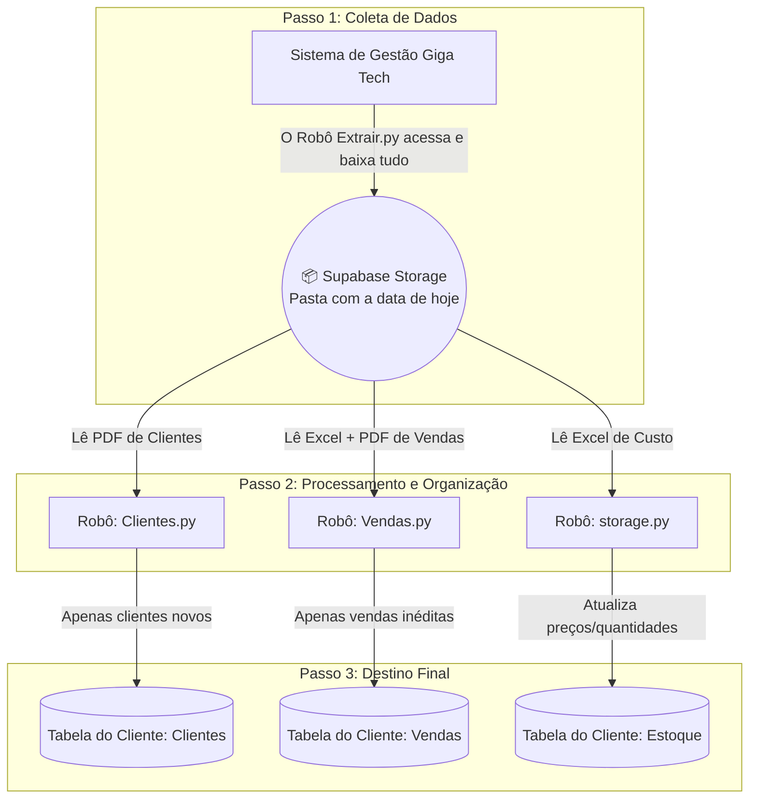

# 🤖 Automação Giga Tech: O Fluxo Simplificado

> [!NOTE]
> Este documento é o mapa definitivo do projeto. Ele explica de forma didática e visual como as informações saem do sistema de gestão web (Giga Tech) e chegam perfeitamente organizadas no banco de dados. Este fluxo foi desenhado para ser totalmente escalável e poder rodar para múltiplos clientes no futuro.

## 🗺️ O Mapa Geral do Fluxo (Como as coisas funcionam)

Abaixo temos o "caminho" que os dados fazem, do início (sistema Giga Tech) até o fim (banco de dados de cada cliente):

## 🎯 De-Para: Qual Código faz O Quê?

Aqui está a tradução exata de qual script é responsável por qual relatório e para qual tabela do Supabase os dados são enviados.

| 🖥️ Nome do Código (Script) | 📄 Qual Relatório ele lê da Nuvem? | 🗄️ Em qual Tabela do Supabase ele salva? | 🛠️ O que ele faz exatamente? |
| :--- | :--- | :--- | :--- |
| **`Extrair.py`** | *(Nenhum. Ele gera todos eles do sistema)* | **Bucket "Relatorios"** (Armazenamento de Arquivos) | Faz o login no sistema web Giga Tech, baixa os 4 relatórios brutos do dia e guarda todos na "nuvem" na pasta de hoje. |
| **`Clientes.py`** | `Relatorio de Clientes Novos.pdf` | Tabela **`clientes`** *(do cliente específico)* | Compara os nomes do PDF com o banco. Cadastra clientes novos e corrige errinhos de digitação nos antigos. |
| **`Vendas.py`** | `Relatorio de Vendas.xls`   `Relatorio de Vendas Vendedor.pdf` | Tabela **`Vendas For Men`** *(ou tabela dinâmica de Vendas)* | "Casa" os valores do Excel com o nome do vendedor do PDF. Insere no banco apenas as vendas que ainda não estavam lá. |
| **`storage.py`** | `Relatorio de Custo Estoque.xls` | Tabela **`Estoque`** *(via variável do .env)* | Compara o Excel com o banco atual usando o código de barras (EAN). Atualiza custos, preços e as quantidades do estoque. |

## 💡 A Metáfora para não esquecer mais!

Pense na loja/empresa do seu cliente como um grande restaurante e nesses robôs como os funcionários mais dedicados que prestam serviço a ele:

- O **`Extrair.py`** é o **Gerente Geral**: Ele vai de setor em setor (telas do sistema web Giga Tech) no final do expediente recolhendo toda a papelada e joga em cima de uma grande mesa para os outros processarem (a mesa é a pasta no Supabase Storage).
- O **`Clientes.py`** é a **Recepcionista da porta**: Ela pega a prancheta de clientes novos na mesa, olha quem são as caras novas e coloca o nome deles na lista VIP do banco de dados do cliente.
- O **`Vendas.py`** é o **Contador**: Ele pega os recibos do caixa (Excel) e os bloquinhos dos garçons (PDF), grampeia os dois juntos e lança no livro caixa, garantindo que nenhuma venda seja contabilizada duas vezes.
- O **`storage.py`** é o **Almoxarife**: Ele entra no estoque com a prancheta atualizada (Excel) e vai prateleira por prateleira conferindo os códigos de barras para ter certeza de que o custo e a quantidade do banco batem exatamente com a realidade física.
